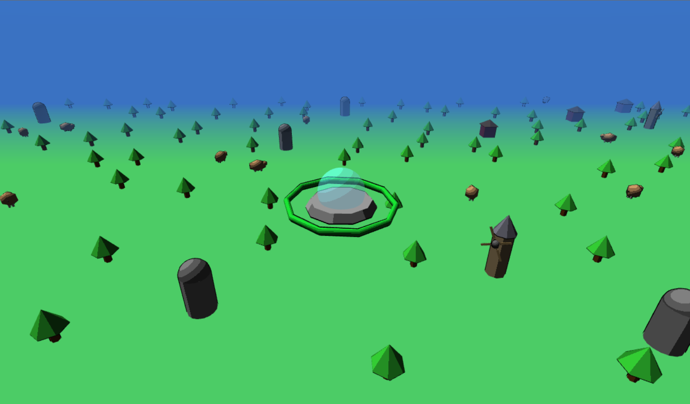
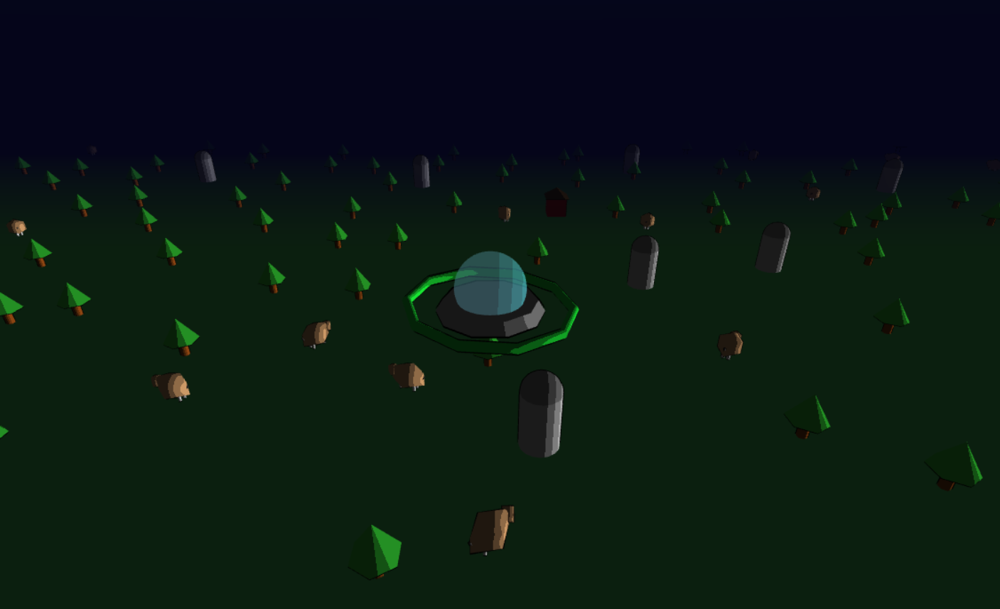
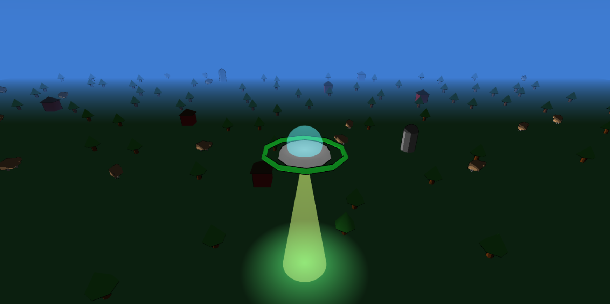

# OVNI na Fazenda — Trabalho Prático 2

Um OVNI sobrevoando uma fazenda low-poly, desenvolvido com WebGL e TWGL.js.

## Screenshots

## Controles

| Tecla | Ação |
|-------|------|
| W / ↑ | Mover para frente |
| S / ↓ | Mover para trás |
| A / ← | Mover para a esquerda |
| D / → | Mover para a direita |
| Espaço | Ativar raio de abdução |
| 1 | Câmera top-down |
| 2 | Câmera lateral |
| C | Alternar ângulo da câmera lateral (frente/trás/direita/esquerda) |
| L | Ligar/desligar iluminação |
| N | Ligar/desligar névoa (fog) |

## Autor

- Gustavo Alcântara do Nascimento

## Link do Trabalho Publicado

- https://gustavoalcantaran.github.io/TP2/

## Vídeo da Entrega 

- https://youtu.be/UOAlGYhjsaA

## Itens Obrigatórios Implementados

- Plano com cenário contendo 5 tipos de objetos distribuídos harmonicamente: árvores, silos, celeiros, vacas e moinhos
- Objeto central (OVNI) com modelagem hierárquica composta por:
  - Corpo/chassi (cone truncado)
  - Cabine com vidro semitransparente
  - Anel com rotação contínua
- Controle de voo via teclado no plano XZ com inclinação dinâmica
- 2 câmeras alternáveis pelas teclas 1 e 2, com 4 ângulos laterais via tecla C
- Projeção perspectiva
- Iluminação dinâmica com toon shading (estilo low-poly)
- Tecla L para ativar/desativar iluminação

## Extras Implementados

- **Ciclo dia/noite (10%):** a direção e intensidade da luz mudam ao longo do tempo, alterando a cor do céu de azul claro (dia) para azul escuro (noite)
- **Skybox (10%):** esfera com gradiente de cor envolvendo toda a cena, sincronizada com o ciclo dia/noite
- **Neblina/Fog (4%):** efeito de névoa ativável pela tecla N, com cor sincronizada ao ciclo dia/noite
- **Cabine com vidro semitransparente (4%):** a cúpula do OVNI é renderizada com transparência
- **Mais tipos de objetos (4%):** 5 tipos (3 obrigatórios e 2 adicionais) de objetos no cenário — árvores, silos, celeiros , vacas e moinhos
- **Música de fundo (3%):** trilha sonora em loop
- **Raio de abdução:** cone transparente com efeito de luz no chão ativado pela barra de espaço